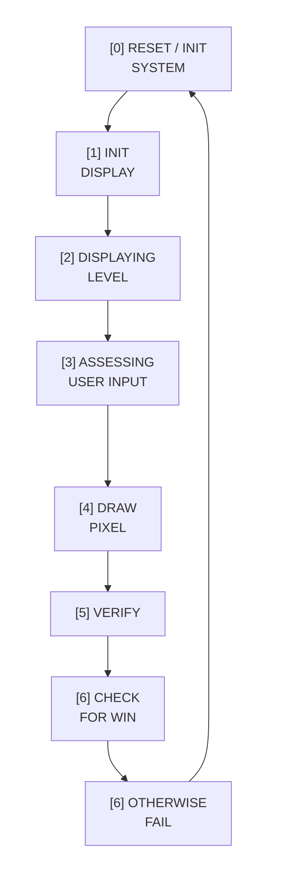

# Pixel Puzzle 🎮🧩

Pixel Puzzle is a memory and pattern-copying game written entirely in low-level **STUMP** assembly, running on a custom STUMP processor and peripheral board.

You’re briefly shown a random target pattern on the 8×8 LED matrix. Your job is to recreate that pattern by moving a cursor around the grid and toggling pixels on or off. As levels increase, more pixels are added to the pattern and the game becomes harder.

> This repo contains my **COMP22111 Exercise 3** submission, which achieved a **96%** mark.

---

## Demo

**Gameplay demo (click to watch):**

---

## How the Game Works

- At the start of each level, a **random target pattern** is displayed on the LED matrix.
- The pattern is also stored in a **level memory table** in RAM.
- You move a cursor over the 8×8 grid and **toggle pixels on/off** to build your guess.
- Each selected pixel is tracked in a separate **user selection table**.
- Pressing `#` (**submit**) compares both tables:
  - ✅ Pixels you selected **and** that belong to the pattern stay **red**.
  - ❌ Pixels you **missed** (not selected but part of the pattern) are shown in **green**.
  - ❌ Pixels you selected that **weren’t** in the pattern flash **red/black**.
- If the tables match exactly, you advance to the next level (with more pixels).
- You can perform a **hard reset** at any time with **switch SW-D**, which:
  - Resets the level counter to 1  
  - Clears both memory tables and the matrix  
  - Restores the intro screen

---

## Controls

All movement & actions use the keypad:

- `2` – Move **up**
- `8` – Move **down**
- `4` – Move **left**
- `6` – Move **right**
- `5` – **Toggle/select** the current pixel
- `#` – **Submit** your pattern (check for win / show fail feedback)
- **SW-D** (on the switch bank) – **Hard reset** back to level 1

---

## Project Structure

This repository follows the structure provided for the exercise:

- **`Exercise3/pixel_puzzel.s`**  
  Main source file containing all core game logic and table definitions.

- **`Exercise3/pixel_puzzle.kmd`**  
  Board configuration file for the CAD toolchain.

---

## Main Game Logic

The core loop follows the execution cycle documented in the `GAME LOGIC` comments in `pixel_puzzel.s`.

### Pixel Puzzle Execution Cycle

