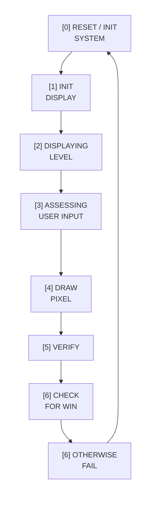

# Pixel Puzzle 🎮🧩

Pixel Puzzle is a pattern-copying game written entirely in low level STUMP assembly code which runs on a STUMP processor we designed and built: you’re shown a target pixel pattern, and your goal is to recreate it by toggling pixels on the grid until your board matches the target.

> This repo contains my **Exercise 3** submission files which achieved a 96% mark.

---

## Demo Videos

**Gameplay demo (click to watch):**  

---

## How the Game Works

- A random target pattern is displayed.
- You move around the grid and toggle pixels on/off.
- The objective is to match the target pattern as efficiently as possible.
- The game gets increasingly more difficult
- Once a player fails wrongly selected pixels flash, correct pixels selected stay red, unselected correct pixels go green.

---

## Project Structure

This repository follows the structure provided for the university exercise.

- **`Exercise3/pixel_puzzel.s`**  
  The **main source file** containing all core game logic,

- **`Exercise3/pixel_puzzle.kmd`**  
  Config file

## Main Game Logic

This project’s core loop follows the same execution cycle shown in the `GAME LOGIC`
comments in `pixel_puzzel.s`.

### Pixel Puzzles Execution Cycle

## How I made the code efficient

- Memory tables
- Jump and branches via stored locations in memory tables then overwriting PC value
- Reusing subroutines e.g. reset

## [0] RESET / INIT

Everything is resetted, including all peripherals used and memory tables if the level is greater than 1
initial variables are set

## [1] INIT DISPLAY
on the LCD where pixel puzzle displays going left to right vice versa if the game starts up, otherwise the if the level is greater than 1 we display the current level

## [2] DISPLAY LEVEL
Create random positions then store these values in the level memory table

## [3] ASSESSING USER INPUT
Read keypad input and assess what user has pressed

## [4] DRAW PIXEL
based on whatt user selected Slowly begin to draw the pixel but whilst we do two validation checks, if 5 selected then store in user selected memory map
## [5] VERIFY
check is the position already selected, if so we cant change the colour of that pixel, check is the previous position selected if so we cant change that back to black

## [6] CHECK FOR WIN
Check if user selected memory map matches the level memory map

## [6] OTHERWISE FAIL
If failed stop the game, wrongly selected pixels flash, correct pixels selected stay red, unselected correct pixels go green. allow a user to reset with SW-D go back to the start and reset levels/memory tables/peripherals

